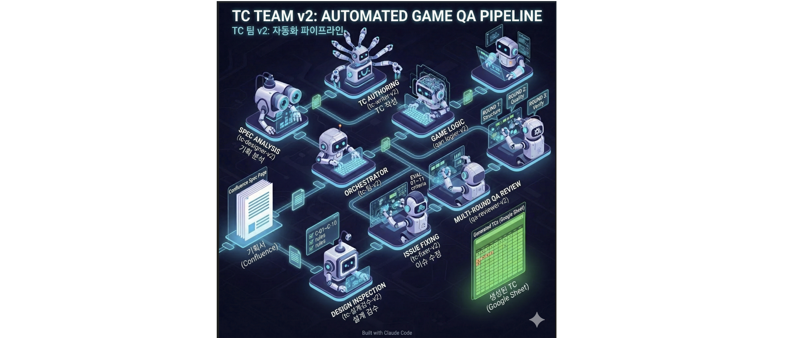

# AI_GAME_QA_TestCase — TC Team v2

<a href="https://claude.ai/code">
  
</a>
&nbsp;
<a href="https://tc-team-v2-landing.vercel.app/">
  
</a>

> **Multi-agent, multi-model game-QA test-case automation pipeline.**
> Drop in a spec (Confluence / PDF / Word / Excel) — get back a fully reviewed **300-TC Google Sheet** — fully automated, zero manual click-through.

[](https://tc-team-v2-landing.vercel.app/)
[](docs/ARCHITECTURE.md)
[](docs/SETUP.md)
[](docs/PREREQUISITES.md)

---

## ⚡ TL;DR

- **7-stage multi-agent pipeline** — Claude Opus for analysis/design, Sonnet for review, Haiku for coding
- **4 input formats** — Confluence URL / PDF / Word (`.doc`, `.docx`) / Excel (`.xlsx`, `.xls`), auto-detected
- **Smart model routing** — Opus reasons, Sonnet reviews, Haiku codes — all via Claude Code CLI, no external API needed
- **Hybrid subagent + orchestrator pattern** — orchestrator spawns each worker as an isolated `claude` CLI process
- **Resume logic** — checkpoint-based via `state.json`; survives mid-run interruptions
- **SSoT rule management** — one skill file per stage, every agent reloads on change
- **Auto-completion tail** — master dashboard refresh + K/L project panel + Google Drive sync
- **Zero human click-through time beyond the initial 2 links** (~1 min of human attention per 300-TC run)

---

## 📊 Measured metrics (300-TC feature run)

| Metric | Manual QA | TC Team v2 | Δ |
|--------|:---:|:---:|:---:|
| Hands-on engineer time | ~3 hours | ~40 min | **~80% ↓** |
| Actual human click/type time | ~3 hours | **~1 min** | **~180× ↓** |
| Review rounds | 1 (manual) | 2 (auto, merged R2+Fix) | 2× |
| Dashboard / Drive sync | manual | automatic | ∞ |
| Supported input formats | 1 | **4** | — |
| Resume on interruption | ❌ | ✅ checkpoint-based | — |
| External API/server required | — | **None** (Claude Code CLI only) | — |

Output quality benchmarked against a 3-year senior QA engineer: terminology consistency, verifiability, spec coverage, and EVAL 01~11 criteria all measured at parity or better.

---

## 🏗 Architecture



**Hybrid subagent + orchestrator**. `tc-팀-v2` is called by main Claude via the Task tool — so it runs in its own context — and internally dispatches each stage to a dedicated worker agent as a **separate `claude` CLI process** spawned via Bash. Every worker gets an isolated context window; the orchestrator writes checkpoints to `state.json` before each step transition and resumes from the last successful step on restart.

### Pipeline stages

| # | Stage | Agent | Model | Conditional | ~Time |
|---|-------|-------|-------|-------------|:---:|
| INIT | Workspace init + spec ingestion | orchestrator | Node.js + MCP | — | — |
| 1 | Spec analysis & TC design | `tc-designer-v2` | Claude Opus · `effort:med` | — | ~40m |
| 2 | Design inspection (C-01 ~ C-10) | `tc-설계검수-v2` | Claude Opus · `effort:low` | — | ~10m |
| 3 | Design fix (max 1×) | `tc-designer-v2` | Claude Sonnet | `needs_fix == true` | ~10m |
| 4 | TC authoring → Google Sheets | `tc-writer-v2` | Claude Haiku | — | ~3m |
| 5 | Review R1 (structure) | `qa-reviewer-v2` | Claude Sonnet | — | ~10m |
| 6 | Fix R1 | `tc-fixer-v2` | Claude Haiku | `issues > 0` | ~2m |
| 7 | Review R2 + Fix R2 (merged one-context pass) | `tc-리뷰2수정2-v2` | Claude Sonnet | — | ~10m |
| DONE | Dashboard refresh + K·L panel + Drive sync | orchestrator | Node.js | — | ~2m |

See [docs/ARCHITECTURE.md](docs/ARCHITECTURE.md) for the full data-flow diagram, resume-logic implementation, and orchestration internals.

---

## 🧠 Smart model routing — the design decision

We don't throw the same model at every stage. Each model has a sweet spot:

| Model | Role | Stages |
|-------|------|--------|
| **Claude Opus** | Deep reasoning — spec analysis, design | STEP 1, 2 |
| **Claude Sonnet** | Balanced — review, design fixes | STEP 3, 5, 7 |
| **Claude Haiku** | Fast coder — mechanical text generation | STEP 4, 6 |

- **Opus handles**: spec analysis, design inspection (complex judgment)
- **Sonnet handles**: structural review, merged review+fix (balanced reasoning)
- **Haiku handles**: TC authoring (writing rows into Sheets), fix-application (applying reviewer prescriptions)

All models are called through **Claude Code CLI** (`claude --model <model> --agent <agent>`) — no external API keys, no SDK dependencies, no local model servers needed.

| Stage | Before (v1 — Gemma4 local) | After (v2 — Haiku CLI) | Improvement |
|-------|:---:|:---:|:---:|
| STEP 4 TC authoring | Gemma4 · ~10 min · preamble bugs | Haiku CLI · ~3 min · clean output | 3× faster, no bugs |
| STEP 6 Fix R1 | Gemma4 · ~10 min · quota limits | Haiku CLI · ~2 min · no limits | 5× faster, reliable |
| Setup complexity | Ollama install + VRAM + API key | None (Claude Code built-in) | Zero setup |

---

## 🚀 Quick start

Assumes [Claude Code](https://claude.ai/code) is already installed. Everything else the setup script handles.

```bash
git clone https://github.com/nobles92ts-ship-it/AI_GAME_QA_TestCase.git
cd AI_GAME_QA_TestCase

# Windows
.\setup.ps1

# macOS / Linux
bash ./setup.sh
```

The setup script:
- Auto-detects Node.js and Claude Code CLI paths
- Installs agents/skills/commands into `~/.claude/`
- Replaces `{NODE_PATH}` / `{CLI_JS}` / `{WORK_ROOT}` / `{CLAUDE_HOME}` / `{CONFLUENCE_SITE}` / `{MASTER_DASHBOARD_ID}` placeholders
- Creates `.env` and `pipeline_config.json` from templates
- Runs `npm install`

Then in Claude Code:

```
/tc-v2 <google-sheets-url> <spec-source> [<spec-source-2> ...]
```

`<spec-source>` can be any of:

```
Confluence URL         https://yoursite.atlassian.net/wiki/spaces/.../pages/111
PDF file               C:/specs/feature.pdf
Word doc               /home/you/specs/feature.docx
Excel spreadsheet      "C:/my specs/matrix.xlsx"
```

Multiple sources can be mixed in a single batch run — the orchestrator iterates sequentially and each feature gets its own isolated run with independent state.

Full walkthrough: [docs/SETUP.md](docs/SETUP.md) · Dependency details: [docs/PREREQUISITES.md](docs/PREREQUISITES.md)

### MCP servers

Two MCP servers need to be registered in `~/.claude/.mcp.json` (template: [`.mcp.json.example`](.mcp.json.example)):

```json
{
  "mcpServers": {
    "google-sheets": {
      "command": "node",
      "args": ["<NPM_GLOBAL>/mcp-google-sheets/dist/index.js"],
      "env": {
        "GOOGLE_SHEETS_CLIENT_ID": "...",
        "GOOGLE_SHEETS_CLIENT_SECRET": "...",
        "TOKEN_PATH": "<HOME>/.mcp-google-sheets-token.json"
      }
    },
    "claude_ai_Atlassian": { "...": "..." }
  }
}
```

`google-sheets` and `Atlassian` are third-party or Claude Code built-in. No local model server (Ollama) is required — all model calls go through Claude Code CLI.

---

## 🛠 Tech stack

| Layer | Tech |
|-------|------|
| Agent runtime | Claude Code CLI (Opus 4.6 · Sonnet 4.6 · Haiku 4.5) |
| Orchestration | Bash + Node.js (CLI process spawning, state persistence, Bash↔MCP bridging) |
| Input parsers | `xlsx` (Excel) · `pdf-parse` / `pdfjs-dist` (PDF) · `mammoth` (Word) · MCP (Confluence ADF) |
| Output | Google Sheets API via `googleapis` |
| MCP integrations | `google-sheets` (third-party), `claude_ai_Atlassian` |

---

## 🗺 Repository structure

```
AI_GAME_QA_TestCase/
├── agents/                        # Claude agent definitions
│   ├── tc-팀-v2.md                # Orchestrator — state.json + worker spawning
│   ├── tc-designer-v2.md          # STEP 1 / STEP 3
│   ├── tc-설계검수-v2.md          # STEP 2 — design quality gate (C-01~C-10)
│   ├── tc-writer-v2.md            # STEP 4 — TC authoring (Haiku)
│   ├── qa-reviewer-v2.md          # STEP 5 — structural review
│   ├── tc-fixer-v2.md             # STEP 6 — fix application (Haiku)
│   ├── tc-리뷰2수정2-v2.md        # STEP 7 — merged R2 + fix pass
│   └── tc-updater-v2.md           # Spec-change detection + surgical TC update
│
├── commands/
│   └── tc-v2.md                   # /tc-v2 slash command (entry point)
│
├── skills/                        # Per-stage SSoT skill files
│   ├── tc-설계/  tc-생성/  tc-리뷰/  tc-수정/  tc-갱신/  tc-설계검수/
│   ├── haiku/                     # Haiku writer/fixer skill definitions (STEP 4, 6)
│   └── 완료처리/  tc-대시보드/    # Pipeline-tail skills
│
├── scripts/
│   └── util/                      # Node utilities
│       ├── google_auth.js         # Google OAuth (client_secret + token flow)
│       ├── update_dashboard.js    # Master dashboard refresh
│       ├── add_project_info.js    # K/L project-info panel
│       ├── upload_md_to_drive.js  # Specs → Drive sync
│       ├── create_gsheet_tc_from_json.js
│       ├── apply_fixes.js
│       ├── read_gsheet_data.js
│       └── v2/                    # Pipeline state / gate / timing infrastructure
│
├── docs/
│   ├── PREREQUISITES.md           # Full dependency install guide
│   ├── SETUP.md                   # Step-by-step walkthrough
│   └── ARCHITECTURE.md            # Pipeline internals + data flow
│
├── credentials/                   # OAuth files (gitignored, .gitkeep only)
├── assets/                        # Pipeline diagram
├── .env.example
├── .mcp.json.example
├── pipeline_config.json.template
├── package.json                   # npm deps: googleapis, xlsx, pdf-parse, pdfjs-dist, mammoth, ...
├── requirements.txt               # Python deps (optional — for local analysis utilities)
├── setup.ps1 / setup.sh           # Platform-specific installers
└── landing-button.svg             # Landing page link badge
```

---

## 🔮 Roadmap

### ✅ Phase 1 — Multi-source TC automation & auto-completion (shipped)
- Confluence / PDF / Word / Excel → Google Sheets generation
- 7-stage multi-agent pipeline (Claude Opus / Sonnet / Haiku via CLI)
- Merged review + fix pass for faster quality cycles
- Auto-completion tail: dashboard / K·L panel / Drive sync
- `tc-updater-v2` for surgical spec-change updates (Confluence only for now)

### 🔜 Phase 2 — Intelligent TC management
- TC history version control & diff view
- Cross-feature dependency analysis
- Auto-classification of automatable TCs
- Auto QA-report generation (PDF / Markdown / Confluence)
- PDF/Word spec-change detection extension for `tc-updater-v2`

### 🌟 Phase 3 — Physical test execution
- Generate automation scripts from TCs
- Auto-run against game builds
- Auto-reflect execution results back to the TC sheet
- Regression test automation loop

---

## 🤖 Built with Claude Code

This entire project — every agent definition, every orchestration Bash block, every skill rule, all documentation — was designed, built, and iterated end-to-end using [Claude Code](https://claude.ai/code).

For non-developers or a higher-level overview of what this system does, see the **[landing page](https://tc-team-v2-landing.vercel.app/)**.
