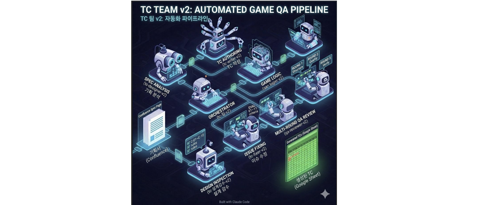

# AI_GAME_QA_TestCase — TC Team

<a href="https://claude.ai/code">
  
</a>
&nbsp;
<a href="https://tc-team-v2-landing.vercel.app/">
  
</a>

> **Game-QA test-case automation — the LLM writes only sentences and judgment; deterministic code owns structure and facts.**
> Drop in a spec (Confluence / PDF / Word / Excel) — get back a fully reviewed **~100-TC test sheet** as a local **Excel (`.xlsx`)** file (no Google needed) — or a Google Sheet if you want one. Fully automated, zero manual click-through.

[](https://tc-team-v2-landing.vercel.app/)
[](docs/ARCHITECTURE.md)
[](docs/SETUP.md)
[](docs/PREREQUISITES.md)

> 🧭 **Two generations in one repo — what runs today vs. where it's going.**
> What `install.ps1` installs — and what `/tc-team` / `/tc-로컬` run — **today** is the **proven multi-agent pipeline** (`agents/` · `skills/` · `scripts/`). The **next-generation deterministic engine** — the architecture this README leads with — lives in [`tc_v3/`](tc_v3/README.md) as a **library preview**: every stage is runnable and regression-tested, but the single-command driver that chains them end-to-end is still on the roadmap (see **Roadmap** below).

---

## ⚡ 딸깍 설치 (한 줄) — 당신의 Claude로, 무료로

> **이 도구는 "당신의" Claude Code 로그인(구독)으로 "당신 PC에서" 실행됩니다.**
> 추가 요금 0원 — 평소 Claude 쓰던 **구독 사용량만 약간 소모**됩니다. 로그인 토큰은 **이 PC를 절대 벗어나지 않습니다.**

PowerShell을 열고 아래 한 줄을 붙여넣으세요:

```powershell
irm https://raw.githubusercontent.com/nobles92ts-ship-it/AI_GAME_QA_TestCase/main/install.ps1 | iex
```

- **권장 플랜: `Max (5x / 20x)`** — TC 한 세트 생성은 사용량이 꽤 들어 `Pro`는 사용 한도에 빨리 닿을 수 있습니다. (Pro도 동작은 합니다.)
- **요구사항**: Windows · [Node.js LTS](https://nodejs.org) · Claude Code 로그인(`claude` → `/login`). 설치기가 Claude Code는 없으면 자동 설치합니다.
- **결과는 로컬 엑셀(`.xlsx`)로 바로 나옵니다 — 구글 설정 불필요.** 구글 시트로 받고 싶을 때만 최초 1회 구글 연결 → [docs/PREREQUISITES.md](docs/PREREQUISITES.md).

설치 후: 터미널에서 `claude` 실행 →
- **가장 쉬운 방법 (구글 불필요)**: `/tc-로컬 <기능명> <기획서파일>` → 테스트케이스가 **엑셀(`.xlsx`)** 파일로 자동 생성됩니다.
- **(선택) 구글 시트**: **스프레드시트 링크 + 기획서 링크**를 함께 주면 TC 팀이 시트에 생성합니다.

---

## ⚡ TL;DR

- **Two-lane architecture** — the LLM writes only sentences and judgment; **deterministic code owns structure, gates, and the coverage ledger** (engine preview in [`tc_v3/`](tc_v3/README.md))
- **6-stage engine pipeline** — S1 Design (Opus, once) → S2 Gate + Slice (deterministic) → S3 sentence fan-out (Sonnet, parallel) → S4 adversarial review, 3 lenses + judge (Sonnet) → S5 Apply + Gates (deterministic) → S6 Live write + Finalize (deterministic) — **the sheet is written exactly once**
- **Coverage ledger** — every source rule ends the run as covered, justifiably excluded, or a gate FAIL — missing rules are named, not hidden in a percentage
- **Measured** (cold-run A/B, n=1, same spec) — **2.2× faster wall-clock** (159 → 73 min), **0 invented numerics**, **100% of rules explained** by the ledger
- **What ships today** — the proven multi-agent pipeline: 4 spec formats auto-detected (Confluence / PDF / Word / Excel), local `.xlsx` (no Google) or Google Sheets output, checkpoint resume, everything via Claude Code CLI (no external API)
- **Install = one line, run = one command** — `install.ps1`, then `/tc-로컬` (local Excel) or `/tc-team` (Google Sheets; legacy `/tc-v2` still works)

---

## 📊 Measured metrics — cold-run A/B

Same source spec (~86 KB wiki document), both pipelines run from cold, **n=1**:

| Metric | Multi-agent pipeline (ships today) | Deterministic engine (`tc_v3/`) | Δ |
|--------|:---:|:---:|:---:|
| Wall-clock to live tab | 158.8 min / 178 rows | 73.0 min / 184 rows | **2.2× faster** |
| Pipeline-specific segments (excl. shared design stage) | 81.2 min | 29.1 min | **−64%** |
| Writing stage | 55.2 min | 5.4 min | parallel fan-out + deterministic assembly |
| Invented numeric values in final output | 2 | **0** | caught by the source-check lens |
| Source rules explained (covered or justified exclusion) | 47 unexplained | **100% explained** | 3 real gaps found and sealed |

Honesty notes: n=1 on one spec — treat this as a **validated case study, not a benchmark suite**. The design stage uses the same mechanism in both, so the fair comparison is the pipeline-specific **−64%**. Quality verdicts come from an adversarial adjudication that re-checked both sides' claims against the artifact files — and it also logged defect classes in the engine's own output as an open backlog.

---

## 🏗 Architecture

**Two lanes.** The LLM owns only sentences and judgment; deterministic code owns structure and facts. Every LLM artifact must pass a machine gate before it can affect anything downstream.

| Lane | Owns |
|------|------|
| **LLM lane** — creative segments only, parallel fan-out allowed | design judgment · step sentences · review findings · fix-plan verdicts · semantic rule-to-TC mapping |
| **Deterministic lane** — code-owned, regression-tested | row skeletons · ids, formatting, grouping · patch application · gate checks · ledger math · the single sheet write |

### Engine pipeline (S1–S6)

| Stage | Lane / model | What happens |
|-------|--------------|--------------|
| **S1 · Design** | LLM — Opus, exactly once | spec source → analysis + design docs; an identical design hash on re-run skips the stage |
| **S2 · Gate + Slice** | deterministic | design gate (convert dry-run on an isolated copy) · slicer decomposes the source into sections + rules — the ledger anchors |
| **S3 · Sentence fan-out** | LLM — Sonnet, parallel | code converts the design into a row skeleton; agents fill in **only the step-sentence column**, 25-row chunks in parallel; merge blocks on any echo / hash / count mismatch |
| **S4 · Adversarial review** | LLM — Sonnet | 3 independent lenses (structure / quality / source-check) in parallel → a judge cross-examines, drops false positives, and emits fix-plan patches + the coverage ledger |
| **S5 · Apply + Gates** | deterministic | patches applied only if the recorded before-value matches the actual cell; regroup; content gate |
| **S6 · Live write + Finalize** | deterministic | the **single** sheet contact — idempotent write, read-back QA (what was written == what is there), then housekeeping |

**Four deterministic gate families** — **convert · merge · content · ledger** — sit between the lanes. A failed gate re-runs only the failing chunk (S3) or triggers a second fix-plan round (S4); nothing touches the live sheet until every gate passes.

**Coverage ledger.** A single coverage percentage can hide *which* rule is missing. The ledger instead requires every rule extracted from the source to end the run as **covered** (mapped to TC ids), **justifiably excluded** (four allowed reasons), or a **gate FAIL** — missing rules are called by name.

Full detail with Mermaid diagrams: [`tc_v3/README.md`](tc_v3/README.md) · deep-dive guide: [`tc_v3/docs/tc-v3-guide.html`](tc_v3/docs/tc-v3-guide.html).

### What installs and runs today — the multi-agent pipeline



The execution path this repo installs is a **hybrid subagent + orchestrator** design: the orchestrator dispatches each stage to a dedicated worker agent as a **separate `claude` CLI process**, so every worker gets an isolated context window. It runs 6 stages (spec analysis & design → design inspection → conditional design fix → TC authoring → two merged review+fix passes), writes checkpoints to `state.json` before each transition, and resumes from the last successful step on restart. This is the pipeline the deterministic engine was A/B-measured against — and it remains the supported end-to-end path until the engine's single driver lands.

See [docs/ARCHITECTURE.md](docs/ARCHITECTURE.md) for both: the engine architecture in depth and the current pipeline's stage table, data flow, and resume internals.

---

## 🧠 Smart model routing — the design decision

One deep-reasoning call, cheap parallel fan-out, and **no model at all** where code is stronger:

| Route | Used for | Why |
|-------|----------|-----|
| **Claude Opus — exactly once** | S1 spec analysis & design | the only stage that needs deep, whole-spec reasoning |
| **Claude Sonnet — parallel fan-out** | S3 step sentences (25-row chunks) · S4 review lenses + judge | many small, independent language tasks — parallelism beats a bigger model |
| **No LLM — deterministic code** | skeletons, gates, ledger math, patch application, the sheet write | structure and facts are cheaper, faster, and safer as code |

All model calls go through **Claude Code CLI** — no external API keys, no SDK dependencies, no local model servers needed. The multi-agent pipeline that ships today routes the same way at a coarser grain: Opus for the design stage, Sonnet for everything else.

---

## 🚀 Quick start

> **What this installs:** the proven **multi-agent pipeline** — today's end-to-end execution path. The deterministic engine ships alongside it in [`tc_v3/`](tc_v3/README.md) as a library preview (each stage individually runnable and tested; the single-command driver is on the roadmap). There is no separate install step for it — it arrives with the clone.

Assumes [Claude Code](https://claude.ai/code) is already installed. Everything else the setup script handles.

```bash
git clone https://github.com/nobles92ts-ship-it/AI_GAME_QA_TestCase.git
cd AI_GAME_QA_TestCase

# Windows (fresh PCs default to ExecutionPolicy Restricted — this form works everywhere)
powershell -ExecutionPolicy Bypass -File .\setup.ps1

# macOS / Linux
bash ./setup.sh
```

The setup script:
- Auto-detects Node.js and Claude Code CLI paths
- Installs agents / skills / commands into `~/.claude/`
- Resolves the 7 path placeholders in place — `{NODE_PATH}`, `{CLI_JS}`, `{PROJECT_ROOT}`, `{WORK_ROOT}`, `{CLAUDE_HOME}`, `{CLAUDE_AGENTS_DIR}`, `{CLAUDE_SKILLS_DIR}`
- Runs `npm install` (`googleapis` + `xlsx`)
- Creates an optional `.env` (the pipeline also runs without it)

**For Google Sheets output (optional)**, place your Google OAuth desktop-client JSON at `credentials/client_secret.json` and run `npm run auth` once — the local `.xlsx` flow needs none of this. Full details: [docs/SETUP.md](docs/SETUP.md).

Then in Claude Code — **local Excel output (no Google needed):**

```
/tc-로컬 <feature-name> <spec-file>
```

…produces a local **`.xlsx`** file. Or, for **Google Sheets output** (one-time Google connection required):

```
/tc-team <google-sheets-url> <spec-source> [<spec-source-2> ...]
```

`<spec-source>` can be any of:

```
Confluence URL         https://yoursite.atlassian.net/wiki/spaces/.../pages/111
PDF file               C:/specs/feature.pdf
Word doc               /home/you/specs/feature.docx
Excel spreadsheet      "C:/my specs/matrix.xlsx"
```

Multiple sources can be mixed in a single batch run — the orchestrator iterates sequentially and each feature gets its own isolated run with independent state.

Full walkthrough: [docs/SETUP.md](docs/SETUP.md) · Dependency details: [docs/PREREQUISITES.md](docs/PREREQUISITES.md)

### MCP servers

Two MCP servers need to be registered in `~/.claude/.mcp.json` (template: [`.mcp.json.example`](.mcp.json.example)):

```json
{
  "mcpServers": {
    "google-sheets": {
      "command": "node",
      "args": ["<NPM_GLOBAL>/mcp-google-sheets/dist/index.js"],
      "env": {
        "GOOGLE_SHEETS_CLIENT_ID": "...",
        "GOOGLE_SHEETS_CLIENT_SECRET": "...",
        "TOKEN_PATH": "<HOME>/.mcp-google-sheets-token.json"
      }
    },
    "claude_ai_Atlassian": { "...": "..." }
  }
}
```

`google-sheets` and `Atlassian` are third-party or Claude Code built-in. No local model server (Ollama) is required — all model calls go through Claude Code CLI.

---

## 🛠 Tech stack

| Layer | Tech |
|-------|------|
| Agent runtime | Claude Code CLI (Opus + Sonnet, selected via `--model` aliases) |
| Orchestration | Bash + Node.js (CLI process spawning, state persistence, Bash↔MCP bridging) |
| Deterministic engine (preview) | `tc_v3/lib/` — 12 single-file Node utilities (slicer, gates, patch applier, sheet writer…) + regression tests (`node tc_v3/test/run_all.js`) |
| Input parsers | `xlsx` (Excel) · Claude Code native file read (PDF, Word) · MCP (Confluence) |
| Output | Local **Excel (`.xlsx`)** via `xlsx` (default, no Google) · Google Sheets API via `googleapis` (optional) |
| MCP integrations | `google-sheets` (third-party), `claude_ai_Atlassian` |

---

## 🗺 Repository structure

```
AI_GAME_QA_TestCase/
├── tc_v3/                         # ★ Next-generation deterministic engine — library preview
│   ├── lib/                       #   12 deterministic utilities (slicer, design/content gates,
│   │                              #   fix-plan applier, traceability ledger, sheet writer…)
│   ├── test/                      #   node tc_v3/test/run_all.js — green with no setup
│   ├── docs/tc-v3-guide.html      #   full architecture guide (12 sections, diagrams, ops)
│   └── README.md                  #   engine overview with Mermaid diagrams
│
├── agents/                        # Claude agent definitions (multi-agent pipeline — runs today)
│   ├── tc-팀-v2.md                # Orchestrator — state.json + worker spawning
│   ├── tc-designer-v2.md          # STEP 1 (Opus) + STEP 3 design fix
│   ├── tc-설계검수-v2.md          # STEP 2 — design quality gate (C-01~C-13)
│   ├── tc-대조-v2.md              # STEP 2 — optional knowledge-base cross-reference (off by default)
│   ├── tc-writer-v2.md            # STEP 4 — TC authoring (Sonnet)
│   ├── tc-리뷰1수정1-v2.md        # STEP 5 — merged R1 review + fix
│   ├── tc-리뷰2수정2-v2.md        # STEP 6 — merged R2 review + fix
│   ├── tc-updater-v2.md           # Spec-change detection + surgical TC update
│   └── qa-reviewer-v2.md / tc-fixer-v2.md   # legacy split R1 agents — rollback only
│
├── commands/
│   ├── tc-team.md                 # /tc-team slash command (entry point)
│   ├── tc-v2.md                   # /tc-v2 — legacy alias, same behavior
│   ├── tc-로컬.md                 # /tc-로컬 — local .xlsx output (no Google)
│   └── tc-이미지매칭.md           # /tc-이미지매칭 — optional spec-image link matching
│
├── skills/                        # Per-stage SSoT skill files
│   ├── tc-분석/  tc-설계/  tc-생성/  tc-리뷰/  tc-수정/  tc-갱신/  tc-설계검수/  tc-대조/
│   ├── tc-학습/  tc-모니터/       # Pattern learning + run monitoring
│   ├── haiku/                     # Sonnet writer/fixer skill definitions (STEP 4, 5)
│   └── 완료처리/  tc-대시보드/    # Pipeline-tail skills
│
├── appscript/
│   ├── tab_manager.gs             # Tab color/sort Apps Script (M3 button + daily 09:00 KST auto-run)
│   └── bvt_slack.gs               # BVT result → Slack push (M6 button)
│
├── scripts/
│   └── util/                      # Node utilities (flat)
│       ├── google_auth.js         # Google OAuth (client_secret + token flow)
│       ├── update_dashboard.js    # Master dashboard refresh
│       ├── add_project_info.js    # K/L project-info panel
│       ├── upload_md_to_drive.js  # Specs → Drive sync
│       ├── deploy_appscript.js    # One-shot deployer — pushes .gs to the Sheets-bound project
│       ├── create_gsheet_tc_from_json.js · read_gsheet_data.js · pipeline_monitor.js
│       ├── confluence_image_downloader.py   # /tc-이미지매칭 helper (Python stdlib only)
│       ├── v2/                    # Pipeline state / gate / timing / report infrastructure
│       └── expander/              # Analysis→design expander (Phase A)
│
├── docs/
│   ├── PREREQUISITES.md           # Full dependency install guide
│   ├── SETUP.md                   # Step-by-step walkthrough
│   ├── ARCHITECTURE.md            # Pipeline internals + data flow
│   └── stability.md               # Reliability / failure-recovery design notes
│
├── credentials/                   # OAuth files (gitignored, .gitkeep only)
├── assets/                        # Pipeline diagram
├── .env.example                   # Optional env overrides (pipeline runs without it)
├── .mcp.json.example              # google-sheets + Atlassian MCP template
├── package.json                   # npm deps: googleapis, xlsx
├── setup.ps1 / setup.sh           # Platform-specific installers (token resolver)
└── landing-button.svg             # Landing page link badge
```

---

## 🔮 Roadmap

### ✅ Shipped — multi-agent pipeline (today's execution path)
- Confluence / PDF / Word / Excel → local Excel (`.xlsx`) by default, or Google Sheets (optional)
- 6-stage pipeline (Opus for design, Sonnet for everything else, all via Claude Code CLI), merged review + fix passes
- Checkpoint resume; auto-completion tail: dashboard / K·L panel / Drive sync / tab color-sort (`tab_manager.gs` + `deploy_appscript.js`)
- `tc-updater-v2` for surgical spec-change updates (Confluence only for now)

### ✅ Shipped — deterministic engine core ([`tc_v3/`](tc_v3/README.md), library preview)
- S1–S6 stage libraries with four deterministic gate families (convert · merge · content · ledger)
- Adversarial review (3 lenses + judge), coverage ledger, single-contact idempotent sheet writer with read-back QA
- Regression tests green with no setup; cold-run A/B validated on a real spec (n=1)

### 🔜 Next — single engine driver
- One command for the whole engine chain (design → live write → finalize) with kickoff, state ledger, and per-stage timing built in — making the engine the execution path behind the existing entry points
- Align the review lenses with the existing 20-rule review checklist; inject learned patterns into prompts
- Fix the remaining known defects from the A/B backlog; speed up the final labeling step

### 🌟 Later — intelligent TC management & physical execution
- TC history version control & diff view; cross-feature dependency analysis
- Auto-classification of automatable TCs; auto QA-report generation (PDF / Markdown / Confluence)
- PDF/Word spec-change detection extension for `tc-updater-v2`
- Generate automation scripts from TCs, auto-run against game builds, and reflect results back to the sheet

---

## 🤖 Built with Claude Code

This entire project — every agent definition, every orchestration Bash block, every skill rule, all documentation — was designed, built, and iterated end-to-end using [Claude Code](https://claude.ai/code).

For non-developers or a higher-level overview of what this system does, see the **[landing page](https://tc-team-v2-landing.vercel.app/)**.
