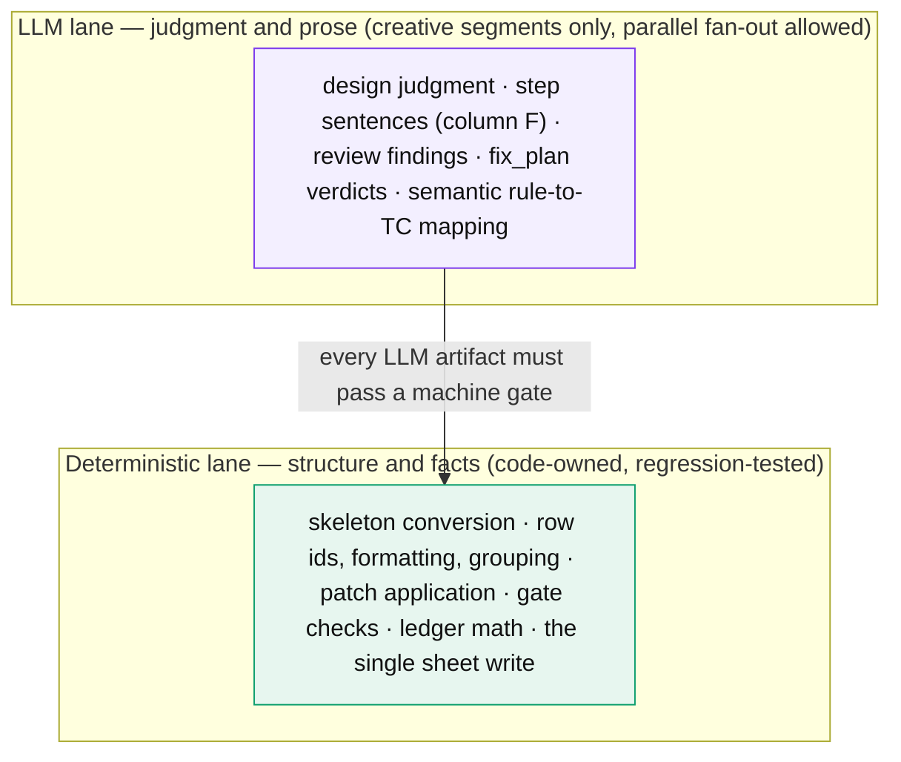
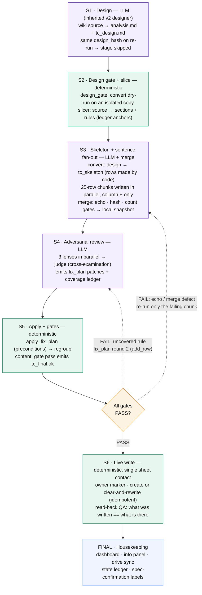
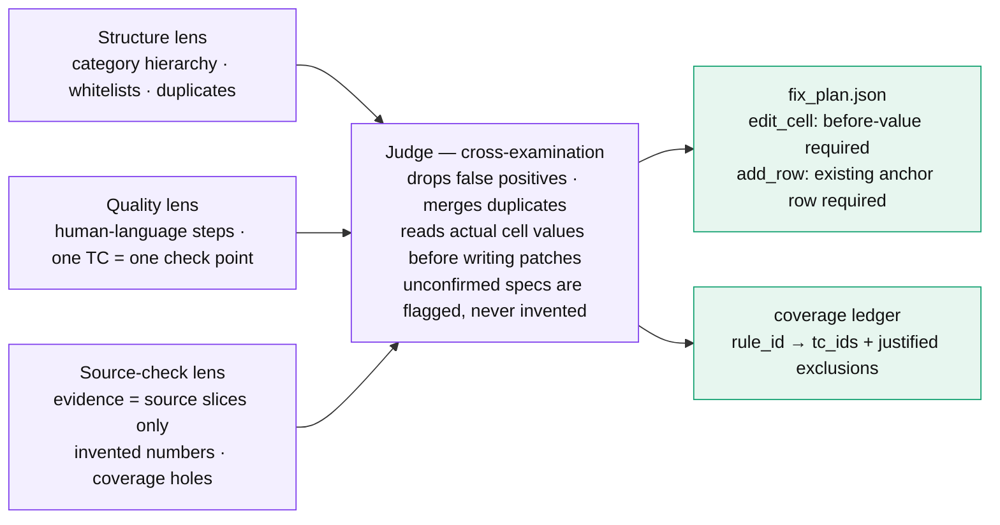
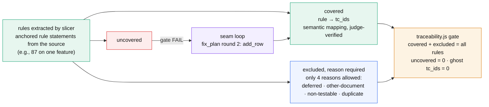

# tc-v3

> Third-generation pipeline for generating game-QA test cases (TC) from a design document.
> Core philosophy: **the LLM owns only sentences and judgment — deterministic code owns structure and facts.**


Input: a feature spec (wiki document). Output: a fully formatted TC set on a live spreadsheet (Google Sheets) or a local snapshot.
Validated on 3 real feature specs end-to-end; a cold-run A/B against the previous generation (v2) measured **2.2x faster wall-clock with higher quality under adversarial adjudication** (n=1, same source spec — see [Measured results](#measured-results)).

---

## Why v3

Previous generations let LLM agents do everything: design, create rows, apply formatting, write to the sheet. It worked, but with two recurring costs — structural accidents (row order, numbering, formatting) whenever an LLM touched structure, and wall-clock time from fully sequential LLM calls.

v3 splits the work into two lanes:



Three principles:

1. **Code owns structure.** The LLM never creates rows. Row skeletons come from a deterministic `convert` of the design document; the LLM only fills in each row's natural-language step text (column F).
2. **Don't trust and verify — just verify.** Every LLM output is machine-checked: echo of its own row positions, design hashes, precondition matching. Even the judge's fix instructions (`fix_plan`) are only applied if the recorded "before" value matches the actual cell.
3. **Review is adversarial.** Independent lenses hunt for flaws in parallel; a judge cross-examines them so only real fixes survive. This structurally blocks the single-reviewer trap of being lenient toward one's own output.

---

## Pipeline at a glance (S1–S6 + FINAL)



How to read it: the left spine (S1 → S5) is the main line. Only when every gate passes does anything touch the sheet. **The sheet can be polluted at exactly one structural point: S6** — and S6 verifies itself by re-dumping the tab and diffing against the final snapshot (read-back QA).

Why the parallel fan-out in S3 is safe: each sentence-writing agent must **echo back the `idx` and sub-category of every row it handled**. If a single row shifts or an agent touches someone else's row, `merge` blocks mechanically. Measured across 3 features: 400+ rows written in parallel, **0 shifts**.

---

## Adversarial review (S4)



Different lenses catch different defects. One measured run: structure 1 + quality 31 + source-check 5 = **37 findings, compressed by the judge into 27 patches** (10 false positives dropped). The judge's own instructions are not trusted either: an `edit_cell` whose before-value does not match the actual cell is auto-rejected (0 conflicts across 47 applied patches), and an `add_row` must anchor to a row that exists.

**Self-correction, observed live:** during a cold run, a sentence-writing agent invented a "500ms" figure that appears nowhere in the source. The source-check lens grepped the source slices ("no 500-series value anywhere"), the judge confirmed removal, and the final output contained 0 invented numerics. The previous pipeline shipped 2 of the same error class in its final output on the same spec. **The difference is structure, not model.**

---

## Five layers of gates

| Layer | Enforced by | Mode | Checks | Measured effect |
|---|---|---|---|---|
| L1 Input | driver + `design_gate.js` (isolated convert) | block | source size floor (500 B) · design hash | stops rotten fetches and design defects early |
| L2 Integrity | `merge` · `apply_fix_plan.js` | block | idx/sub-category echo · count match · design_hash re-check · patch before-value · anchor existence | 400+ rows, 0 shifts · 47 patches, 0 conflicts |
| L3 Structure | `validatePreWrite` · `regroup.js` | block | category-group contiguity (V-17) · platform enum · remark whitelist · numbering continuity | scattered groups auto-sealed |
| L4 Content | `content_gate.js` | block + warn (2 tiers) | abstract phrasing blocked · deferral phrasing (unflagged = block, flagged = warn) · "exactly + verb" warned | new rule caught a legacy-output defect on its first run |
| L5 Coverage | `traceability.js` + semantic mapping | block | every rule covered or justifiably excluded, else FAIL | found 3 real gaps the previous pipeline had also missed |

Grading philosophy: **new rules are born as warnings** and promoted to blocking after field data — a false positive that halts the pipeline is also a cost.

---

## Coverage ledger — "which rule", not "what percent"

A single coverage percentage tells two lies: it misreads rewording as loss (token-overlap metrics produced false alarms in practice), and nobody knows *which* rule is missing. v3 keeps a **ledger** instead:



First live run: the ledger gate surfaced real coverage gaps **that the previous pipeline had also silently missed** — e.g., a missing UI-layout verification case on feature B, and two unlimited/uniqueness rules with no covering TC on feature C. All were sealed by adding TCs, then the gate passed. The point of the ledger is to call missing rules **by name** instead of hiding them inside a percentage.

Caveat, stated honestly: the semantic mapping itself is LLM output — which is why the A/B adjudication re-verified the ledger's claims against the files (2 mapper misjudgments were corrected that way).

---

## Deterministic utilities (`tc_v3/lib/`)

Twelve single-file Node scripts, minimal dependencies, each runnable from the CLI. A shared batch/retry wrapper backs the network-facing ones.

| File | Stage | Role | Key gate |
|---|---|---|---|
| `slicer.js` | S2 | source → sections/rules deterministic decomposition | heading-parse fallback |
| `design_gate.js` | S2 | convert dry-run on an isolated copy — is the design expandable? | exit 0/4, real specs untouched |
| `snapshot_local.js` | S3 | 7-column merge result → 10-column snapshot without touching the sheet | derivation identical to the sheet writer's |
| `apply_fix_plan.js` | S5 | patch applier — edit_cell / add_row / delete | before-value match · anchor existence · conflict = reject |
| `regroup.js` | S5 | restore category-group contiguity + renumber | V-17 seam |
| `content_gate.js` | S5 | content rule checks (exact inheritance of v2's final gate + extensions) | abstract phrasing = block · deferral / "exactly" = 2-tier |
| `traceability.js` | S4/L5 | coverage ledger gate | uncovered · unjustified exclusion · ghost id = FAIL |
| `sheet_write.js` | S6 | owner-marker-based create / clear-and-rewrite | never touches other tabs · idempotent rewrite |
| `golden_diff.js` | QA | golden snapshot regression diff | structural metric diff |
| `ab_compare.js` | QA | deterministic A/B metrics (scale, distribution, violations) | token coverage is an approximate label — the ledger is canonical |
| `state_projection.js` | S7 | pipeline state-ledger projection | — |
| `force_clean.js` | ops | clean up failed-run leftovers | only after owner-marker check |

---

## Running it

Conceptual stage sequence (exact wiring lives in the pipeline driver):

```bash
# S1  Design (LLM, inherited v2 designer) → specs/<feature>/analysis.md + tc_design.md
#     Re-runs with an identical design_hash skip this stage entirely.

# S2  Gate + slice
node tc_v3/lib/design_gate.js  specs/<feature>/tc_design.md        # must exit 0
node tc_v3/lib/slicer.js       specs/<feature>/<source>.md  WORK/slices.json

# S3  Skeleton → parallel sentence fan-out → merge → snapshot
#     convert: tc_design.md → WORK/tc_skeleton.json   (rows created by code)
#     fan-out: 25-row chunks → WORK/tc_f_map.json     (LLM writes column F only)
#     merge:   echo · hash · count gates → WORK/tc_data.json
node tc_v3/lib/snapshot_local.js  WORK/tc_data.json  WORK/v3_snapshot.json  <tab-name>

# S4  Adversarial review (3 lenses + judge) → WORK/fix_plan.json + coverage ledger

# S5  Apply + gates
node tc_v3/lib/apply_fix_plan.js  WORK/v3_snapshot.json WORK/fix_plan.json WORK/v3_tc_final.json --ledger WORK/applied_patches.json
node tc_v3/lib/regroup.js         WORK/v3_tc_final.json WORK/v3_tc_final.json
node tc_v3/lib/content_gate.js    WORK/v3_tc_final.json               # blocking gate
node tc_v3/lib/traceability.js    WORK/slices.json WORK/coverage.json WORK/exclusions.json WORK/traceability.json

# S6  Live write (single sheet contact) + read-back QA + FINAL housekeeping
node tc_v3/lib/sheet_write.js     WORK/v3_tc_final.json <sheet-id> <tab-name> WORK
```

Every intermediate artifact is a file in the per-feature work directory, so **any stage can be replayed and audited**:

```
WORK/
├─ slices.json                    source slices: sections + rules      [S2]
├─ tc_skeleton.json               row skeleton (idx, category, leaf)   [S3 convert]
├─ tc_f_map.json                  step sentences {idx, d, f}           [S3 fan-out]
├─ tc_data.json → v3_snapshot.json  7-col merge → 10-col snapshot      [S3 merge]
├─ fix_plan.json (+ r2 …)         judge patches (before/anchor bound)  [S4]
├─ coverage.json · exclusions.json · traceability.json   the ledger    [S4/L5]
├─ v3_tc_final.json + tc_final.ok  gate-passed final                   [S5]
├─ owner_marker.json              tab ownership proof                  [S6]
└─ applied_patches.json           applied-patch audit trail            [S5]
```

Tests — 76 cases GREEN with no setup (82 total; the integration smokes are fixture-gated and skip cleanly without local data). Merge condition:

```bash
node tc_v3/test/run_all.js
```

Unconfirmed-spec loop (operational): if a spec point is undecided, the row gets a "needs spec confirmation" flag in its remark (inventing a value is blocked by the L4 deferral rules). Flagged rows are auto-joined with their source slices into a confirmation request for the design team; answers come back as a **single fix_plan pass** that replaces just those cells and clears the flags — no full regeneration.

---

## Measured results — cold-run A/B

Same source spec (~86 KB wiki document), both pipelines run sequentially from cold, n=1.

| Metric | v2 (previous gen) | v3 | Delta |
|---|---|---|---|
| Total wall-clock to live tab | 158.8 min / 178 rows | 73.0 min / 184 rows | **2.2x faster** |
| Pipeline-specific segments (excl. shared design stage) | 81.2 min | 29.1 min | **-64%** |
| Writing stage | 55.2 min | 5.4 min | parallel fan-out + deterministic assembly |
| Invented numeric values in final output | 2 | **0** | caught by source-check lens |
| Rules explained by ledger (covered or justified exclusion) | 47 unexplained | **100% explained** | 3 real gaps found and sealed |

Notes for honesty:

- The design segment uses the same mechanism in both (77.5 vs 43.9 min is run variance); the fair comparison is the pipeline-specific 64% reduction.
- v3 reviews *deeper* (3 adversarial lenses vs. sequential self-review) while still being faster.
- Quality verdicts come from an adversarial adjudication that re-checked both sides' claims against files — and it also logged 3 defect classes in v3's own output as an open backlog. n=1 on one spec; treat the numbers as a validated case study, not a benchmark suite.

---

## Repository layout

```
tc_v3/
├─ lib/        12 deterministic utilities (see table above)
├─ test/       unit + integration tests — node tc_v3/test/run_all.js (76 GREEN; integration smokes fixture-gated)
├─ docs/
│  └─ tc-v3-guide.html   full architecture guide — 12 sections, diagrams, ops & troubleshooting
└─ README.md   this file
```

## Further reading

- [`tc_v3/docs/tc-v3-guide.html`](docs/tc-v3-guide.html) — the detailed guide this README summarizes: stage-by-stage magnified views, gate catalog, file map, troubleshooting cases actually hit in production (e.g., why arithmetic id remapping after `add_row` is wrong and content-join remapping is used instead).
## Roadmap

- Single driver executable — one command for S1–S7 with kickoff/state-ledger/per-stage timing built in.
- Align review lenses with the existing 20-rule review checklist; inject learned patterns into prompts.
- Fix the remaining known defects from the A/B backlog; speed up the final labeling step.
